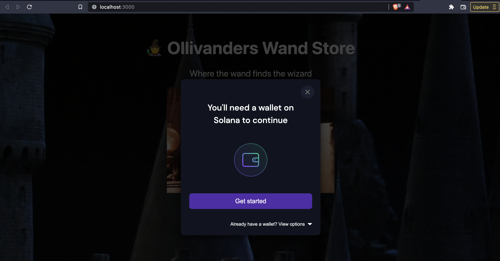

# buildspace Store on Solana Pay Project - Ollivanders Wand shop
Solana Pay is a new, open, and free-to-use payments framework built on Solana — the world’s most performant web3 ecosystem. Solana Pay is built for immediate transactions, fees that are fractions of a penny, and a net-zero environmental impact - https://solanapay.com/

This project is an online version of the fictional store that sells wands from Harry Potter using Solana Pay.

## Still working on:
- [ ] Receiving payment in USDC
- [ ] Upgrading items in store

## To get started with this project, clone this repo and follow these commands:

1. Run `npm install` at the root of your directory
2. Run `npm run dev` to start the project

